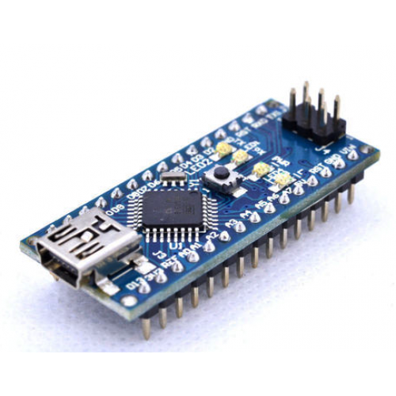
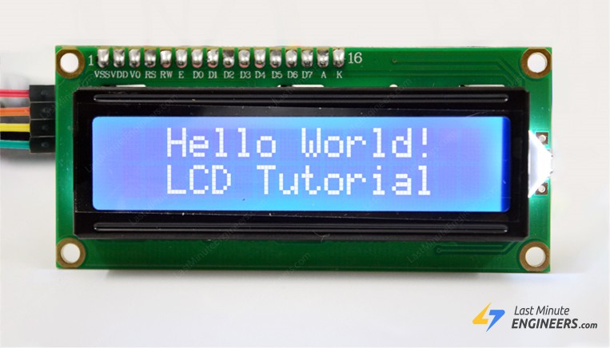
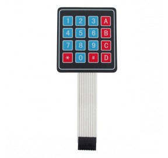

# eStrongBox


```
Partage d'un D.I.Y familiale.
```

### Liste du matériel nécéssaire

* Un arduino nano




* Un Afficheur LCD I2C 2 Lignes 16 Caractères




* Un keypad compatible Arduino




* Un Servo Moteur


