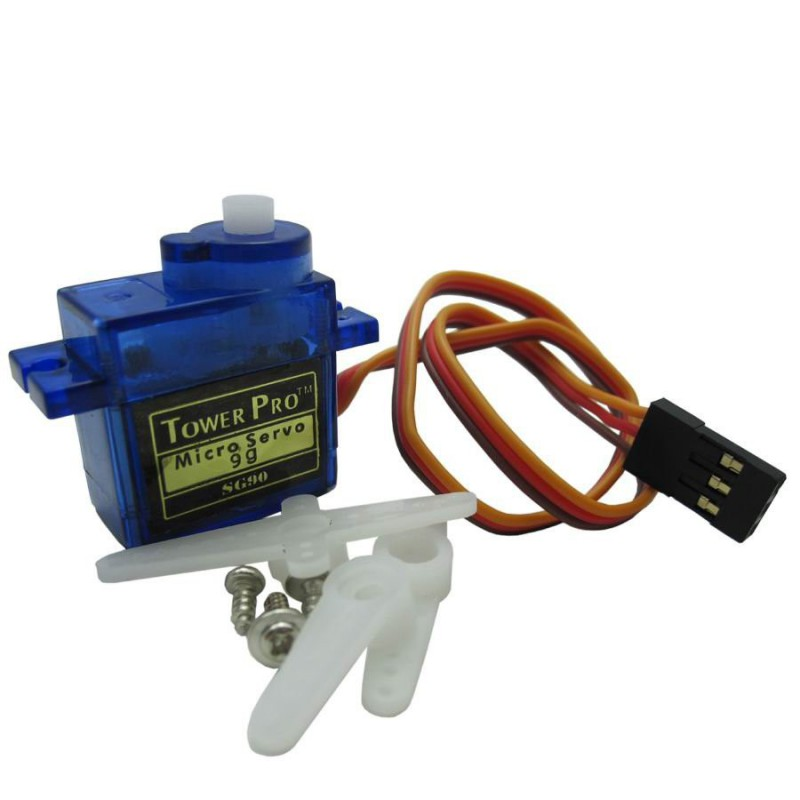

# eStrongBox


```
Partage d'un D.I.Y familiale.
```

### Liste du matériel nécéssaire

* Un arduino nano


* Un Afficheur LCD I2C 2 Lignes 16 Caractères


* Un keypad compatible Arduino


* Un Servo Moteur


